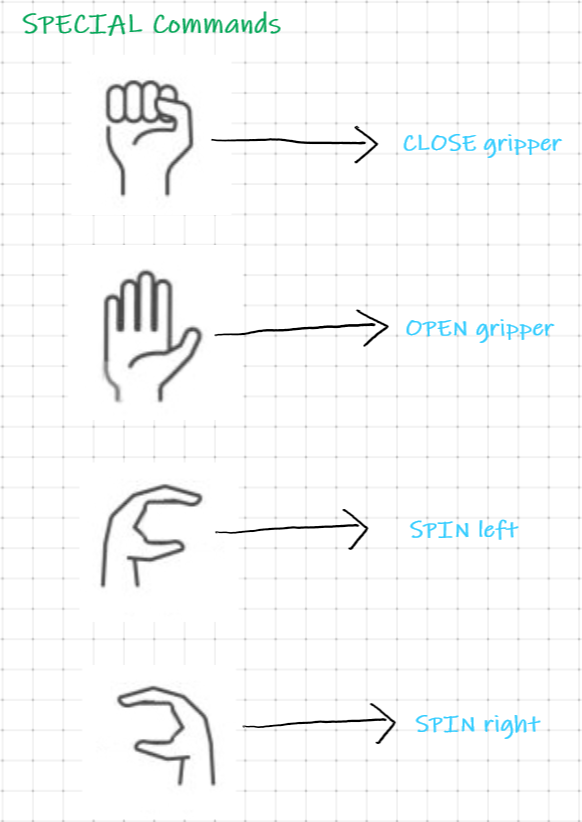

# Robotic hand-gesture control using computer vision

> Automatic control of an UR3e 6 joints robot hand based on the detected human hand gestures.

## Introduction

* What is an UR3e 6 joints robot?
        
    - 

    - _"The UR3e collaborative robot is a smaller collaborative table-top robot, perfect for light assembly tasks and automated workbench scenarios. The compact table-top cobot weighs only 24.3 lbs (11 kg), but has a payload of 6.6 lbs (3 kg),  ±360-degree rotation on all wrist joints, and infinite rotation on the end joint."_

    - 

## Approach

* Our Solution

    - Create a custom language system based on human hand gestures which are recognized by a Trained Neuronal Network and put the robot in motion.
    - 
    - 

* How it works

    - First, the human interacting with the robot must specify via the `JOINT Identification Hand Gesture` table the joint it would like to move.
    - Once the joint has been selected, the human can specify the rotation direction via the `SPIN left` or `SPIN right` gesture.
    - When the desired position is reached, using the `STOP command`, the human can stop the rotation of the join and confirm that it is indeed the desired position via the `CONFIRM command`.

## Introduction

* program1: genedate data samples (`generate_samples.py`)
    - 
* program2: controll robot (`app_controller.py`)
    - 
* program3: train neuronal network (`colab`)
    - 

* program4: 

* dataset:
    - <a href="#">LINK</a>