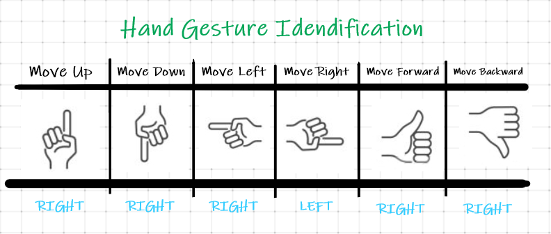
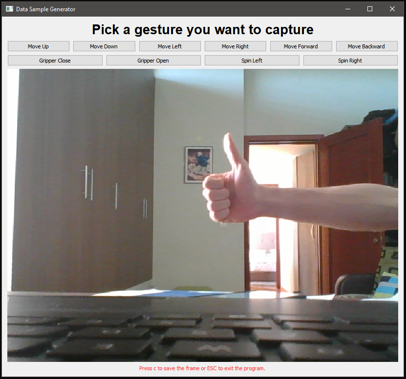
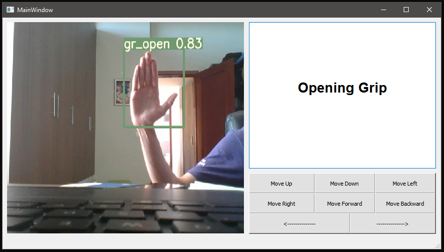

# Robotic hand-gesture control using computer vision

> Automatic control of an UR3e 6 joints robot hand based on the detected human hand gestures.

## Introduction

* What is an UR3e 6 joints robot?
        
    - 

    - _"The UR3e collaborative robot is a smaller collaborative table-top robot, perfect for light assembly tasks and automated workbench scenarios. The compact table-top cobot weighs only 24.3 lbs (11 kg), but has a payload of 6.6 lbs (3 kg),  ±360-degree rotation on all wrist joints, and infinite rotation on the end joint."_

    - 

## Approach

* Our Solution

    - Create a custom Hand Gesture System based on Human Hand Gestures which are recognized by a Trained Neuronal Network.
    - Based on the gesture, instructions are sent to the robot in order to controll it.

* Gesture System

    - Hand Gesture **Movement** System 
    
    - Hand Gesture **Base Rotation & Gripper Controll** System  
    

* How it works

    - First, the human interacting with the robot must specify via the `Hand Gesture Identification` table the direction in which the TCP will move.
    - Once the gesture has been detected, using the `ur_library.py` library, instructions are sent to the robot which moves 1cm at a time in the given direction.
    - To stop the movement, simply stop indicating the gesture.
    - In order to rotate the base on a different direction, the `SPIN left/right` gesture from the `SPECIAL Commands` table must be used.
    - In order to `CLOSE/OPEN gripper`, use the gestures presented in `SPECIAL Commands` table.

## Components

* Component1: genedate data samples (`generate_samples.py`)
    - 
    - Ussage: `python3 generate_samples.py`
    - Scope: this program's purpose is to help the user create/expand a data set for the given gestures. Select a Gesture and then press `c` in order to capture the frame and save it under `train_data/images/categorizes/<gesture>` 

* Component2: train neuronal network (`colab`)
    - 
    - Ussage: follow the steps as presented in the colab, then download the created model.

* Component3: object detection (`detect.py`)
    - Ussage: used within **Component5**
    - Scope: implement a continous detection loop on the given frame and return the results.

* Component4: ur3e library (`ur_library.py`)
    - Ussage: used within **Component5**
    - Scope: 

* Component5: interactive GUI (`app_controller.py`)
    - 
    - Ussage: `python3 app_controller.py`
    - Scope: link all components into a clean interface which displays the input (video feed) and output (robot movement)

* Component6: dataset (`LINK`)
    - <a href="#">LINK</a>

## Requirements

- python-urx: v0.11.02 <a href="https://github.com/SintefManufacturing/python-urx">https://github.com/SintefManufacturing/python-urx</a>
- yolov5: <a href="https://github.com/ultralytics/yolov5">https://github.com/ultralytics/yolov5</a>